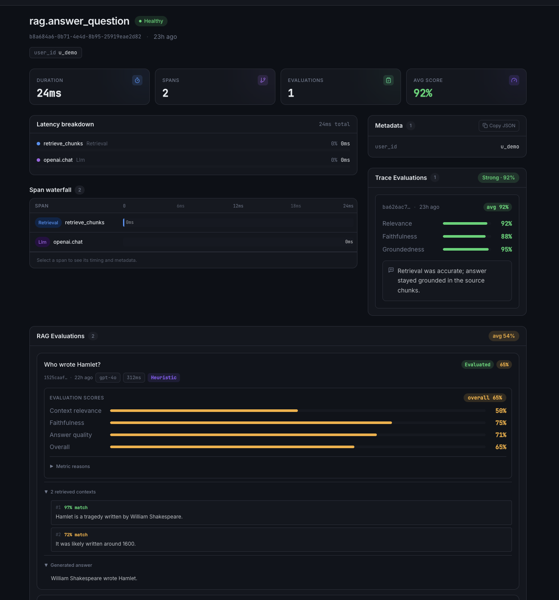
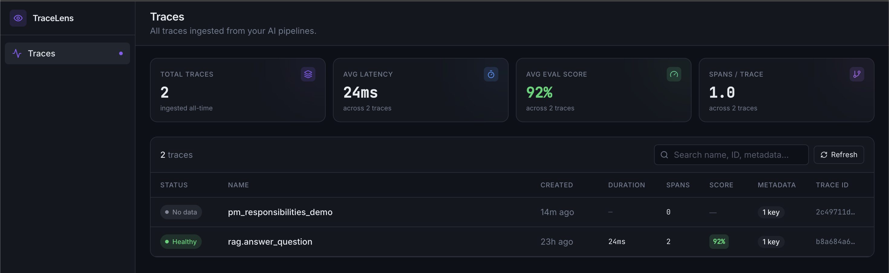

# TraceLens

**Observability and automatic evaluation for RAG and AI agent pipelines.**

TraceLens gives you a clear view into every AI request — what was retrieved, how long each step took, whether the answer was faithful to the source material, and why. Instrument your Python code with three lines, and the dashboard does the rest.

> RAG = Retrieval-Augmented Generation — a common pattern where an AI system fetches relevant documents before generating an answer. TraceLens is purpose-built to debug and evaluate these pipelines.

---

## Dashboard

### Trace detail — span waterfall + automatic RAG evaluation



### Trace list — health, latency, spans, and score at a glance



---

## What it does

- **Traces every AI request** — each call to your RAG pipeline becomes a trace with a full span waterfall showing retrieval time, LLM time, and tool calls.
- **Automatic RAG evaluation** — send a question, answer, and retrieved contexts; TraceLens scores context relevance, faithfulness, and answer quality with no manual labeling.
- **Two evaluation modes** — a free deterministic heuristic judge (no API key, always available) and an optional OpenAI-backed LLM judge with automatic fallback.
- **Dark, developer-focused dashboard** — trace list with health badges, per-trace span waterfall, latency breakdown, and a dedicated RAG Evaluations section with expandable metric reasons and context previews.

---

## Architecture

```
┌─────────────────────────────────────────────────────────────────┐
│  Your Python application                                         │
│                                                                  │
│  from tracelens import TraceLensClient                          │
│  from tracelens.trace import trace                              │
│                                                                  │
│  with trace("rag.pipeline", client=client) as t:               │
│      client.create_span(trace_id=t.trace_id, kind="retrieval") │
│      client.create_span(trace_id=t.trace_id, kind="llm")       │
│      # POST /v1/traces/{id}/rag  ──────────────────────────►   │
└──────────────────────────────────────────────┬──────────────────┘
                                               │ HTTP / REST
                           ┌───────────────────▼──────────────────┐
                           │  FastAPI backend  (Python 3.11)       │
                           │                                       │
                           │  POST /v1/traces/{id}/rag             │
                           │  ┌───────────────────────────────┐   │
                           │  │  Evaluation service            │   │
                           │  │  ├─ HeuristicJudge  (default) │   │
                           │  │  ├─ LLMJudge        (OpenAI)  │   │
                           │  │  └─ FallbackRAGJudge (safety) │   │
                           │  └───────────────────────────────┘   │
                           │                                       │
                           │  PostgreSQL                           │
                           │  ├─ traces / spans                   │
                           │  ├─ rag_observations                 │
                           │  └─ evaluation_results               │
                           └───────────────────┬──────────────────┘
                                               │
                           ┌───────────────────▼──────────────────┐
                           │  Next.js 14 dashboard  (TypeScript)   │
                           │                                       │
                           │  /traces         → trace list         │
                           │  /traces/:id     → trace detail       │
                           │    ├─ span waterfall                  │
                           │    ├─ latency breakdown               │
                           │    ├─ trace evaluations               │
                           │    └─ RAG Evaluations                 │
                           │         context_relevance             │
                           │         faithfulness                  │
                           │         answer_quality                │
                           │         overall                       │
                           └───────────────────────────────────────┘
```

---

## Quick start

Requires [Docker](https://www.docker.com/get-started) and [Docker Compose](https://docs.docker.com/compose/).

```bash
git clone https://github.com/varunmohanraj/tracelens.git
cd tracelens
cp .env.example .env
docker compose up --build
```

| Service | URL |
|---|---|
| Dashboard | http://localhost:3000 |
| API | http://localhost:8000 |
| Swagger UI | http://localhost:8000/docs |

---

## SDK usage

Install the SDK (local dev):

```bash
cd sdk && pip install -e .
```

### Instrument a RAG pipeline

```python
from tracelens import TraceLensClient
from tracelens.trace import trace

client = TraceLensClient(base_url="http://localhost:8000")

with trace("rag.answer_question", client=client, metadata={"user_id": "u_1"}) as t:
    # Record individual steps as spans
    retrieval = client.create_span(
        trace_id=t.trace_id,
        name="retrieve_chunks",
        kind="retrieval",
        metadata={"top_k": 5},
    )
    llm = client.create_span(
        trace_id=t.trace_id,
        name="openai.chat",
        kind="llm",
        metadata={"model": "gpt-4o-mini"},
    )
```

### Auto-evaluate a RAG answer

Send a question, the generated answer, and the retrieved contexts. TraceLens evaluates them and returns scores immediately.

```python
import requests

requests.post(
    f"http://localhost:8000/v1/traces/{t.trace_id}/rag",
    json={
        "question": "What is retrieval-augmented generation?",
        "answer":   "RAG combines a retriever with a language model to ground answers in source documents.",
        "contexts": [
            {"text": "RAG stands for Retrieval-Augmented Generation.", "score": 0.97},
            {"text": "It fetches relevant documents before generating a response.", "score": 0.91},
        ],
        "model":        "gpt-4o-mini",
        "latency_ms":   312,
        "auto_evaluate": True,   # run the judge synchronously and return scores
    },
)
```

Response includes four metric scores under `evaluations[]`:

```json
{
  "evaluation_status": "complete",
  "evaluations": [
    { "metric": "context_relevance", "score": 0.85, "reason": "The context shares many key terms with the question." },
    { "metric": "faithfulness",      "score": 0.90, "reason": "The answer is well-supported by the retrieved context." },
    { "metric": "answer_quality",    "score": 0.80, "reason": "The answer is clear and directly addresses the question." },
    { "metric": "overall",           "score": 0.85, "reason": "Weighted average of the three metrics above." }
  ]
}
```

---

## Evaluation system

TraceLens ships two evaluation judges, selectable per-request or via environment variable.

| Judge | How it works | Cost | Requires |
|---|---|---|---|
| `heuristic` *(default)* | Word-overlap scoring — deterministic, instant, free | None | Nothing |
| `llm` | OpenAI chat completion with structured JSON output | ~$0.001 per evaluation | `OPENAI_API_KEY` |

The LLM judge is wrapped in a `FallbackRAGJudge` — if the OpenAI call fails for any reason (timeout, quota, invalid JSON), it transparently falls back to the heuristic judge and annotates the result with `fallback_used: true`.

**Environment variables** (see `.env.example`):

```bash
TRACELENS_EVAL_JUDGE=heuristic          # default judge: "heuristic" | "llm"
OPENAI_API_KEY=sk-...                   # required only when judge="llm"
TRACELENS_LLM_JUDGE_MODEL=gpt-4.1-mini # OpenAI model for the LLM judge
TRACELENS_LLM_JUDGE_TIMEOUT_SECONDS=20 # timeout before heuristic fallback
```

Override the judge for a single request with `"judge": "llm"` in the POST body.

---

## API reference

All endpoints are prefixed with the API root (`http://localhost:8000`). Full interactive docs at `/docs`.

| Method | Path | Description |
|---|---|---|
| `GET` | `/healthz` | Liveness + DB connectivity check |
| `POST` | `/v1/traces` | Create a trace |
| `GET` | `/v1/traces` | List traces (paginated) |
| `GET` | `/v1/traces/{id}` | Get a single trace |
| `POST` | `/v1/traces/{id}/spans` | Add a span to a trace |
| `GET` | `/v1/traces/{id}/spans` | List spans for a trace |
| `POST` | `/v1/traces/{id}/rag` | Ingest a RAG observation (+ optional auto-evaluate) |
| `GET` | `/v1/traces/{id}/rag` | List RAG observations for a trace |
| `POST` | `/v1/traces/{id}/evaluations` | Attach a manual evaluation |
| `GET` | `/v1/traces/{id}/evaluations` | List evaluations for a trace |

---

## Tech stack

| Layer | Technology |
|---|---|
| **Backend** | Python 3.11, FastAPI, SQLAlchemy 2, Pydantic v2, PostgreSQL 16 |
| **Evaluation** | Heuristic word-overlap judge + OpenAI structured output judge |
| **Frontend** | Next.js 14 (App Router), TypeScript, TanStack Query, Tailwind CSS, Framer Motion |
| **SDK** | Python, `requests` |
| **Infrastructure** | Docker Compose (single `docker compose up` from repo root) |

---

## Project structure

```
tracelens/
├── docker-compose.yml          # one-command local stack (db + backend + frontend)
├── .env.example                # all configurable env vars documented
│
├── backend/                    # FastAPI application
│   ├── app/
│   │   ├── main.py             # app factory, CORS, lifespan
│   │   ├── config.py           # pydantic-settings, reads .env
│   │   ├── db.py               # SQLAlchemy engine + session
│   │   ├── models/             # SQLAlchemy ORM models
│   │   │   ├── trace.py
│   │   │   ├── span.py
│   │   │   ├── rag_observation.py
│   │   │   └── evaluation_result.py
│   │   ├── routes/             # FastAPI routers (one file per resource)
│   │   │   ├── traces.py
│   │   │   ├── spans.py
│   │   │   ├── rag.py
│   │   │   └── evaluations.py
│   │   ├── schemas/            # Pydantic request/response schemas
│   │   └── services/
│   │       └── evaluation/     # pluggable judge system
│   │           ├── types.py    # RAGJudge protocol + MetricResult dataclass
│   │           ├── heuristic_judge.py
│   │           ├── llm_judge.py
│   │           ├── prompts.py  # versioned prompt templates
│   │           ├── factory.py  # FallbackRAGJudge + build_judge()
│   │           └── runner.py   # DB write path, evaluation lifecycle
│   └── tests/                  # pytest, 99 tests
│
├── frontend/                   # Next.js dashboard
│   ├── app/
│   │   ├── (app)/traces/       # trace list + trace detail pages
│   │   └── (marketing)/        # landing page
│   ├── components/
│   │   ├── traces/             # TraceDetail, SpanWaterfall
│   │   └── dashboard/          # Panel, MetricCard, EvaluationPanel,
│   │                           # RAGEvaluationPanel, RAGObservationCard
│   └── lib/
│       ├── api.ts              # typed API client (fetch wrappers)
│       ├── types.ts            # TypeScript interfaces mirroring backend schemas
│       ├── metrics.ts          # score/health derivation (pure functions)
│       └── ragMetrics.ts       # RAG-specific metric helpers
│
├── sdk/                        # Python SDK
│   └── tracelens/
│       ├── client.py           # TraceLensClient (HTTP wrapper)
│       ├── trace.py            # trace() context manager
│       └── types.py            # TraceData, SpanData, EvaluationData
│
├── examples/
│   └── rag_quickstart/
│       └── trace_example.py    # end-to-end demo script
│
└── docs/
    ├── trace-detail.png        # dashboard screenshot — trace detail + RAG evals
    └── trace-list.png          # dashboard screenshot — trace list with health
```

---

## Running tests

```bash
cd backend
pytest
# 99 passed
```

Tests cover RAG observation ingest, heuristic judge scoring, LLM judge with mocked OpenAI client, FallbackRAGJudge behavior, factory judge resolution, prompt generation, and route-level integration paths.

---

## Roadmap

- **Async evaluation queue** — Celery/Redis background workers for high-throughput pipelines
- **Dataset comparison** — diff evaluation scores across prompt versions or model upgrades
- **Alerting** — webhook notifications when overall score drops below a configurable threshold
- **SDK auto-ingest** — `client.rag_observe()` convenience method that wraps the POST + auto_evaluate call
